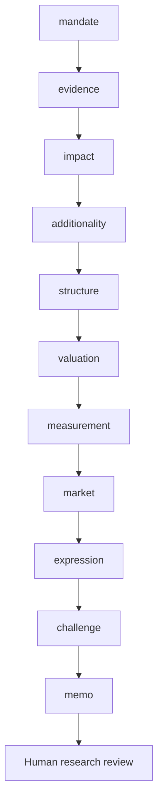

# Workflow

What additional outcomes and financing are plausibly created, who bears the risks, and is the investment commercially and developmentally defensible?

Routes: `impact-investment`, `blended-finance`, `outcome-linked`. These named use cases share a sequential evidence/review core; they are not separately calibrated financial models.

| Step | Research task | Stage ID |
|---|---|---|
| 1 | Mandate and investable decision | `mandate` |
| 2 | Evidence intake and reconciliation | `evidence` |
| 3 | Theory of change and beneficiaries | `impact` |
| 4 | Additionality and investor contribution | `additionality` |
| 5 | Contracts and risk allocation | `structure` |
| 6 | Financial and development economics | `valuation` |
| 7 | Measurement and responsible exit | `measurement` |
| 8 | Market context and implementation evidence | `market` |
| 9 | Investment-decision handoff | `expression` |
| 10 | Independent challenge and exceptions | `challenge` |
| 11 | Investment committee and accountable review | `memo` |

A COMPLETE artifact is structurally complete, not certified correct. Material gaps stop dependencies. Open MATERIAL/CRITICAL issues block research approval. A source-study intentionally stops after the evidence stage.
